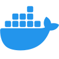
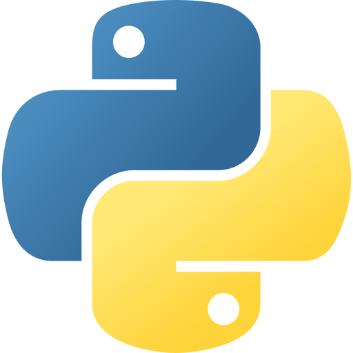

<h1 align="center">
  <!-https://capsule-render.vercel.app/-->
  
</h1>

  <!-https://readme-typing-svg.demolab.com/demo/?size=12&duration=1&pause=0&color=F7F7F7&center=true&vCenter=true&multiline=true&repeat=false&height=100&lines=I'm+a+full+stack+software+developer+passionate+about+;building+clean%2C+scalable%2C+and+reliable+solutions.;+;My+focus+is+on+backend+development%2C+containerized+;environments%2C+and+modern+software+practices.-->
  

 
 

  <!-https://readme-typing-svg.demolab.com/demo/?weight=600&size=16&duration=2000&pause=3000&color=C84349&center=true&vCenter=true&lines=Invent+the+future;Chase+what+inspires+you;Create+something+now;Redesign+yourself+everyday;Learn+something+new;Grow+through+change;Stay+curious;Give+it+a+try;Embrace+the+unknown-->
  

  
  

  <!-https://capsule-render.vercel.app/-->
  

  

    

      <!-https://readme-typing-svg.demolab.com/demo/?weight=600&size=16&duration=1&pause=0&color=F7F7F7&center=true&vCenter=true&multiline=true&repeat=false&height=35&lines=My+skillset-->
      
    

  

  

    <!-https://readme-typing-svg.demolab.com/demo/?size=12&duration=1&pause=0&color=F7F7F7&center=true&vCenter=true&multiline=true&repeat=false&height=100&lines=Computational+Science;(4+years%2C+finished+in+2024);+;Solutions+Architecture+MBA;(1+year%2C+starts+in+2026)-->
    
  

  
   
  
  

    
    
    
    
    
    
    
    
    
    
    
    
  

  

  

    

      <!-https://readme-typing-svg.demolab.com/demo/?weight=600&size=16&duration=1&pause=0&color=F7F7F7&center=true&vCenter=true&multiline=true&repeat=false&height=35&lines=My+languages-->
      
    

  

  
  

    <!-https://readme-typing-svg.demolab.com/demo/?weight=600&size=16&duration=2000&pause=3000&color=C84349&center=true&vCenter=true&lines=Sou+brasileiro!;I'm+brazilian!;Soy+brasile%C3%B1o!;%E7%A7%81%E3%81%AF%E3%83%96%E3%83%A9%E3%82%B8%E3%83%AB%E4%BA%BA%E3%81%A7%E3%81%99%EF%BC%81;Ich+bin+Brasilianer!-->
    
  

   
  
  

    

      
      
    

    

      
      
    

    

      
      
    

    

      
      
    

    

      
      
    

  

  

  

    

      <!-https://readme-typing-svg.demolab.com/demo/?weight=600&size=16&duration=1&pause=0&color=F7F7F7&center=true&vCenter=true&multiline=true&repeat=false&height=35&lines=Git+Stats-->
      
    

  

  

    
    
    <!--
    
    -->
  

  

  

    

      <!-https://readme-typing-svg.demolab.com/demo/?weight=600&size=16&duration=1&pause=0&color=F7F7F7&center=true&vCenter=true&multiline=true&repeat=false&height=35&lines=About+me-->
      
    

  

  

    <!-https://readme-typing-svg.demolab.com/demo/?size=12&duration=1&pause=0&color=F7F7F7&center=true&vCenter=true&multiline=true&repeat=false&width=535&height=115&lines=Working+on+a+solid+portfolio+with+my+skills+and+my+own+UE5+game;Learning+WebSocket+%26+software+architecture+principles;Interested+in+UX%2FUI+design+and+human-centered+tech;Passionate+about+creating+something+cool;I+love+music+and+learning+languages;I+love+programming+since+2016-->
    
  

