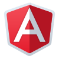
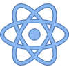
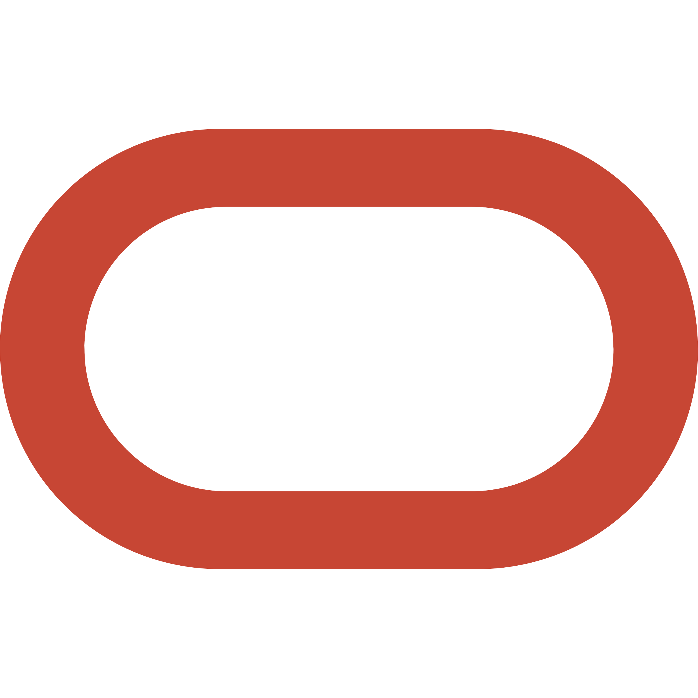
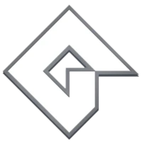

<h1 align="center">Hi, I'm Alexandre</h1>

  <h3>Full stack developer</h3>
  
I'm a full stack software developer passionate about building clean, scalable, and reliable solutions.
  My focus is on backend development, containerized environments, and modern software practices.

  
  

<h3 align="center">My skillset</h3>

  
<strong>Computational Science</strong> – Complete (4 years, finished in 2024)

  
<strong>Solutions Architecture MBA</strong> – WIP (1 year, starts in 2026)

     
     
     
     
     
     
     
     
     
     
     
   

